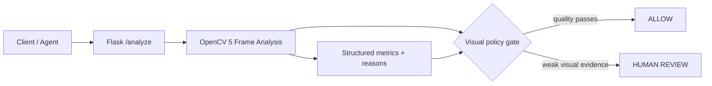
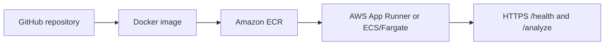

# Architecture

```mermaid
flowchart LR
  A[Client / Agent] --> B[Flask /analyze]
  B --> C[OpenCV 5 Frame Analysis]
  C --> D{Visual policy gate}
  D -->|quality passes| E[ALLOW]
  D -->|weak visual evidence| F[HUMAN REVIEW]
  C --> G[Structured metrics + reasons]
  G --> D
```

Planned AWS delivery path:

```mermaid
flowchart LR
  A[GitHub repository] --> B[Docker image]
  B --> C[Amazon ECR]
  C --> D[AWS App Runner or ECS/Fargate]
  D --> E[HTTPS /health and /analyze]
```
